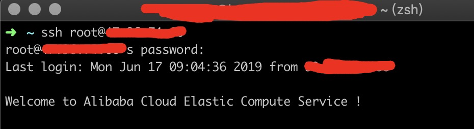
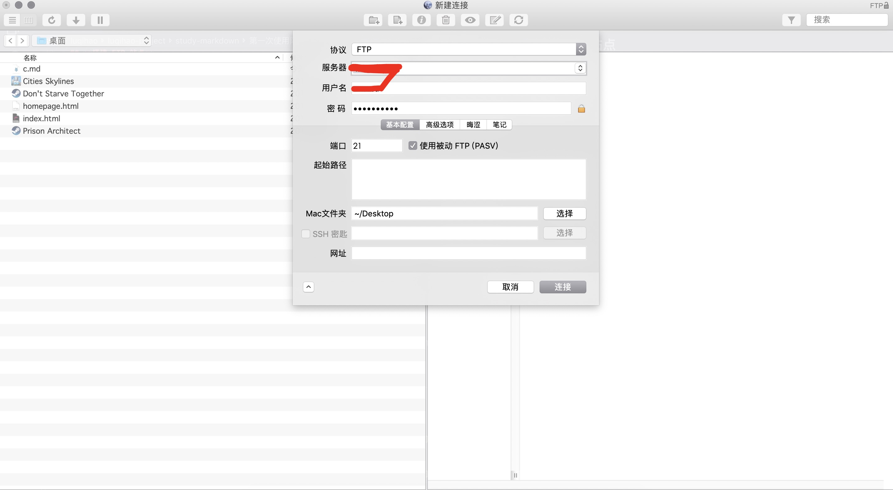
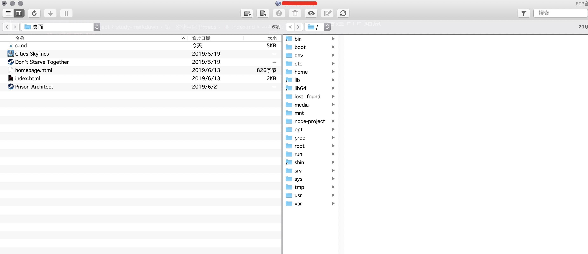
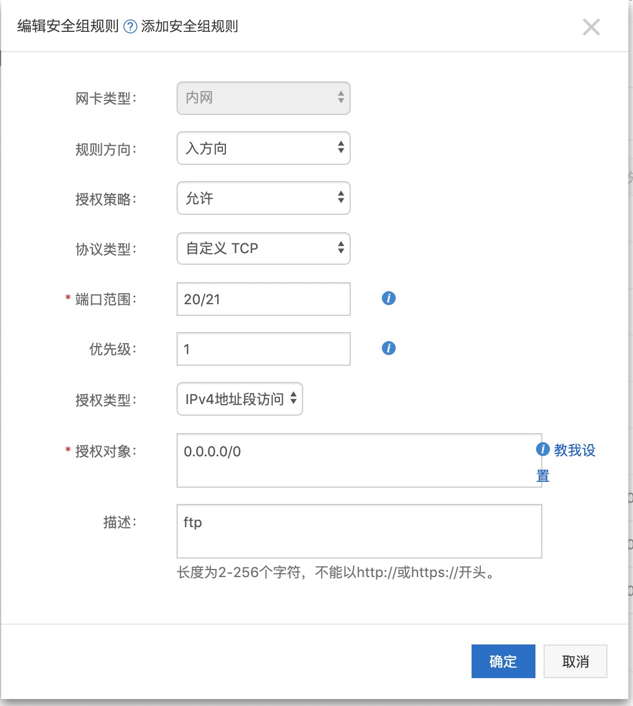
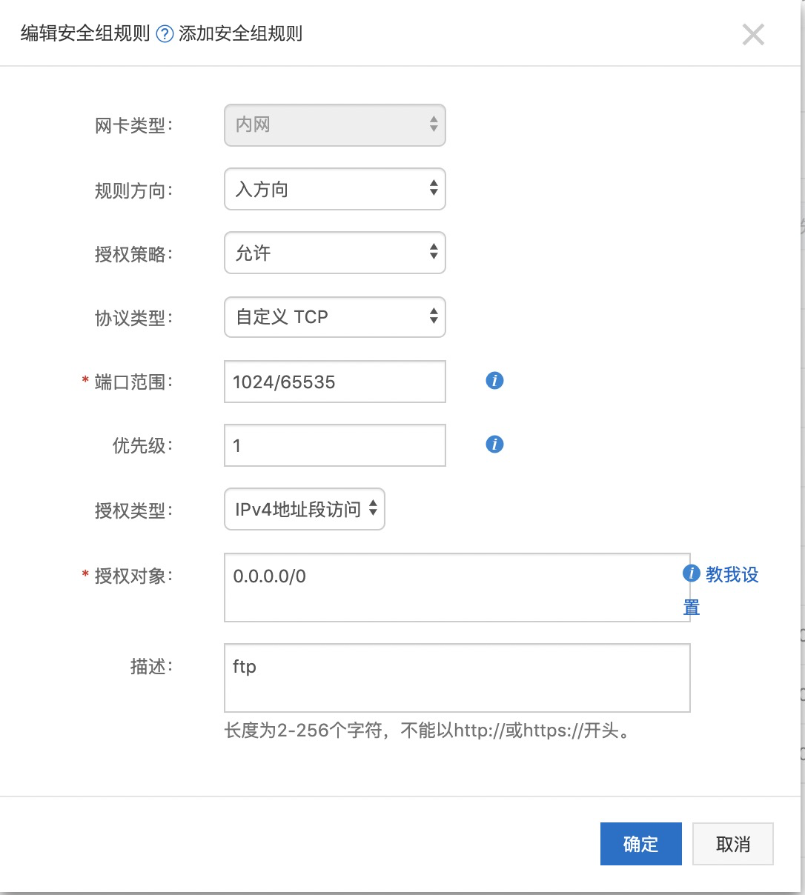
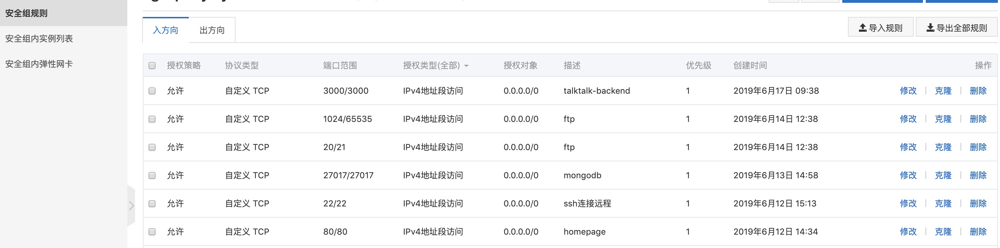

# **第一次使用阿里云 ecs**

前端小白一枚，最近想搞个服务器体验一下部署项目等操作，所以买了个最便宜的阿里云 esc（1 核 1G, CentOS 7.6 64 位），记录一下一些软件安装操作以及踩坑点。

**_下面代码操作提示权限不够请自行在命令前加 sudo， #号后均为注释_**

**_以下涉及到外网连接或访问都需要到阿里云控制台实例安全组设置开放端口_**

## **连接远程服务器**

使用 zsh + ssh 连接远程服务器，root 为用户名称（一开始在网站控制台直接连过去提示输入用户名，亿脸懵逼，之后查了很久才知道，默认就是 root）, xx.xx.xx.xx 为 ecs 分配的公网 ip

```
ssh root@xx.xx.xx.xx
```

输入上面代码回车输入密码即可对远程服务器进行操作，密码自行在控制台实例重置实例密码



如果经过一段时间 zsh 不进行任何操作，zsh 会进入假死状态...所以要修改相关配置，连接远程后执行

```
vim /etc/ssh/sshd_config
```

找到下面两行

```
#ClientAliveInterval 0
#ClientAliveCountMax 3
```

去掉注释，改成

```
ClientAliveInterval 30 # 客户端每隔多少秒向服务发送一个心跳数据
ClientAliveCountMax 86400 # 客户端多少秒没有相应，服务器自动断掉连接
```

重启 sshd 服务

```
service sshd restart
```

然后 zsh 就不会那么快死了...

## **搭建 FTP 站点**

因为想直接通过软件连接远程然后自由进行文件传输，但网上查了很多篇文章乱七八糟的最后连都连不上，之后还是通过阿里云文档中心的教程搞好了，请参考[https:#help.aliyun.com/document_detail/92048.html?spm=5176.10695662.1996646101.searchclickresult.296a78aarAXVlb](https:#help.aliyun.com/document_detail/92048.html?spm=5176.10695662.1996646101.searchclickresult.296a78aarAXVlb)

我唯一不同的是最后使用的测试连接方式和所处环境不同，我是用软件[Yummy FTP](https://yummy-ftp.en.softonic.com/mac)（界面操作简单）进行连接测试的，并且是 macOS 环境。附上图：




**_要去控制台设置安全组！！！要去控制台设置安全组！！！要去控制台设置安全组！！！_**



**_不设置安全组还是会连接不上的！！！如果开放了 21 端口（默认）也不能连接的话可能还要根据下图再配置另一个安全组_**




最后实现的效果只是对开放了权限文件夹进行读写操作（一开始以为能对整个根目录所有文件都可以通过客户端操作进行读写，又或者是我还不知道怎么搞...）

如果不使用上面方法进行文件传输的话还可以使用命令行直接进行操作（使用 mac 自带的 scp 命令）：

```
    # 从远程服务器下载文件到本地的话，前面的是服务器文件路径，后面的是本地mac存放路径
    scp root@xx.xx.xx.xx:/usr/share/nginx/html/404.html /Users/cnbb/Desktop

    # 把本地文件上传到远程服务器的话，前面的是本地mac存放路径文件路径，后面的是服务器存放路径
    scp /Users/cnbb/Desktop/homepage.html root@47.96.74.66:/usr/share/nginx/html
```

## 安装 **nginx**

1.  EPEL 仓库中有 Nginx 的安装包。如果你还没有安装过 EPEL，可以通过运行下面的命令来完成安装：

```
yum install epel-release
yum install nginx
```

2. 设置 Nginx 开机启动

```
systemctl enable nginx
```

3. 启动/停止/重启 Nginx：

```
systemctl start nginx # 启动
systemctl stop nginx # 停止
systemctl restart nginx # 重启
```

最后在设置了安全组的前提下在浏览器输入http://xx.xx.xx.xx（公网ip）:80（默认端口）测试是否可以访问到默认首页，html文件默认摆在路径/usr/share/nginx/html下

## **安装 node**

```
yum install epel-release # 注意上一步已经安装过了哦
yum install nodejs
```

但是这种方法装的 node 版本很低（6.x.x）
所以如果想要升级一下的话可能还要进行以下操作：

-   安装 n

```
npm install -g n
```

-   安装最新版

```
n latest
```

-   安装指定版本

```
n 8.11.3
```

然后，**_一定要重启系统!!!_** 不重启系统的话查看版本还是 6.x.x

## **安装 mongodb**

1. 创建安装配置文件

```
vim /etc/yum.repos.d/mongodb-org-4.0.repo
```

2. 添加配置信息

```
[mongodb-org-4.0]
name=MongoDB Repository
baseurl=https://repo.mongodb.org/yum/redhat/$releasever/mongodb-org/4.0/x86_64/
gpgcheck=1
enabled=1
gpgkey=https://www.mongodb.org/static/pgp/server-4.0.asc
```

3. 安装 mongodb

```
yum install -y mongodb
```

4. 开机自启动

```
systemctl ennable mongod
```

5. 启动 MongoDB

```
systemctl start mongod.service
```

6. 验证服务开启

```
mongo
```

7. 修改配置，以供外网视图管理工具连接

```
vim /etc/mongod.conf

找到

net:
    bindIp: 127.0.0.1

改为

net:
    bindIp: 0.0.0.0
```

mongodb 视图管理工具推荐：[Robo 3T](https://robomongo.org/)

## **安装 git**

```
yum install git
```

---

最后，列出以上涉及到的端口的安全组设置：



the end
